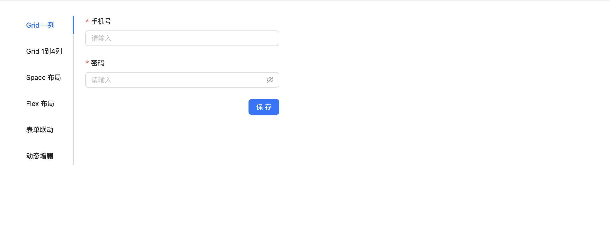
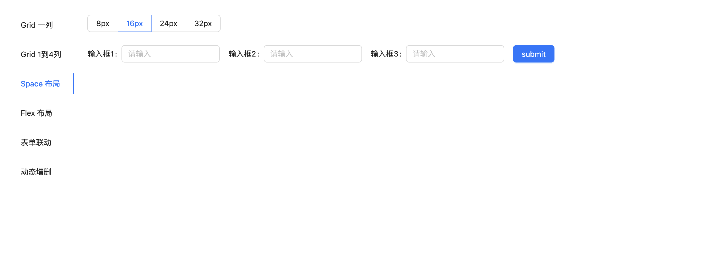
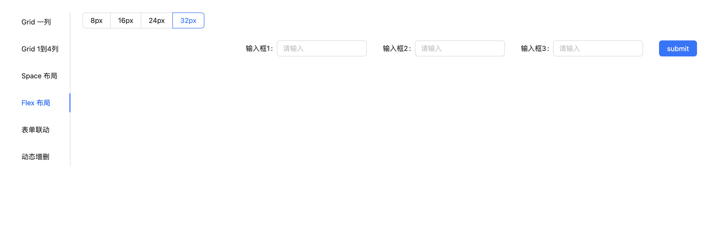

<div align="center">
  <h1>🚀 Antd Form Render</h1>
  <p>Configuration-based Ant Design Form Renderer</p>

  [](https://www.npmjs.com/package/antd-form-render)
  [](https://www.npmjs.com/package/antd-form-render)
  [](https://github.com/leonwgc/antd-form-render/blob/master/LICENSE)
  [](https://www.typescriptlang.org/)

  English | [简体中文](./README.md)

  [📖 Live Demo](https://leonwgc.github.io/antd-form-render/) | [🐛 Report Issues](https://github.com/leonwgc/antd-form-render/issues)
</div>

---

## ✨ Features

- 🎯 **Configuration Driven** - Build complex forms with concise JavaScript configuration
- 🎨 **Multiple Layouts** - Support Grid, Flex, and Space layouts
- 🔄 **Data Driven** - Follow React philosophy `UI = F(state)` for easy form interaction
- 🪝 **Hooks First** - Built with React Hooks, perfect for modern React development
- 📘 **TypeScript** - Full type definitions for excellent developer experience
- ⚡️ **Lightweight** - Clean core code with zero extra dependencies
- 🎭 **Flexible Extension** - Support custom rendering for various business scenarios

## 📦 Installation

```bash
# npm
npm install antd-form-render

# yarn
yarn add antd-form-render

# pnpm
pnpm add antd-form-render
```

**Note:** Requires `antd >= 4.0.0` and `react >= 16.8.0` in your project.

## 🎯 Quick Start

### Basic Usage

```tsx
import React from 'react';
import { Form, Button, Input } from 'antd';
import { GridRender } from 'antd-form-render';

const App = () => {
  const [form] = Form.useForm();

  const layout = [
    {
      label: 'Username',
      name: 'username',
      rules: [{ required: true, message: 'Please input username' }],
      element: <Input placeholder="Enter username" />,
    },
    {
      label: 'Password',
      name: 'password',
      element: <Input.Password placeholder="Enter password" />,
    },
    {
      element: (
        <Button type="primary" htmlType="submit">
          Submit
        </Button>
      ),
    },
  ];

  const onFinish = (values) => {
    console.log('Form values:', values);
  };

  return (
    <Form form={form} onFinish={onFinish} layout="vertical">
      <GridRender layout={layout} />
    </Form>
  );
};

export default App;
```

## 📚 Layout Types

### 1️⃣ Grid Layout

Suitable for forms requiring strict grid alignment.

#### Single Column Layout

<details>
<summary>View Code</summary>

```tsx
import React from 'react';
import { Form, Button, Input } from 'antd';
import { GridRender } from 'antd-form-render';

const GridOneColumn = () => {
  const [form] = Form.useForm();

  const layout = [
    {
      label: 'Phone',
      name: 'tel',
      rules: [{ required: true, message: 'Please input phone number' }],
      element: <Input placeholder="Enter phone" maxLength={11} />,
    },
    {
      label: 'Password',
      name: 'pwd',
      element: <Input.Password placeholder="Enter password" />,
    },
    {
      element: (
        <Button type="primary" htmlType="submit" block>
          Save
        </Button>
      ),
    },
  ];

  return (
    <Form form={form} layout="vertical" style={{ width: 400 }}>
      <GridRender layout={layout} />
    </Form>
  );
};
```

</details>



#### Multi-Column Layout

<details>
<summary>View Code</summary>

```tsx
import React, { useState } from 'react';
import { Input, Radio, Form } from 'antd';
import { GridRender } from 'antd-form-render';

const GridNColumns = () => {
  const [cols, setCols] = useState(4);
  const layout = Array.from({ length: 11 }, (_, i) => ({
    label: `Field ${i + 1}`,
    name: `name${i}`,
    element: <Input placeholder="Enter value" />,
  }));

  return (
    <Form layout="vertical">
      <Radio.Group
        onChange={(e) => setCols(Number(e.target.value))}
        optionType="button"
        value={cols}
        style={{ marginBottom: 24 }}
      >
        <Radio value={1}>1 Column</Radio>
        <Radio value={2}>2 Columns</Radio>
        <Radio value={3}>3 Columns</Radio>
        <Radio value={4}>4 Columns</Radio>
      </Radio.Group>

      <GridRender layout={layout} columnCount={cols} gutter={[8, 8]} />
    </Form>
  );
};
```

</details>


### 2️⃣ Space Layout

Suitable for inline or toolbar form scenarios.

<details>
<summary>View Code</summary>

```tsx
import React, { useState } from 'react';
import { Input, Radio, Form, Button } from 'antd';
import { SpaceRender } from 'antd-form-render';

const SpaceLayout = () => {
  const [form] = Form.useForm();
  const [space, setSpace] = useState(8);

  const layout = [
    ...Array.from({ length: 3 }, (_, i) => ({
      name: `name${i}`,
      label: `Field ${i + 1}`,
      element: <Input placeholder="Enter value" />,
    })),
    {
      element: (
        <Button type="primary" onClick={() => console.log(form.getFieldsValue())}>
          Submit
        </Button>
      ),
    },
  ];

  return (
    <Form form={form} layout="horizontal">
      <Radio.Group
        onChange={(e) => setSpace(Number(e.target.value))}
        optionType="button"
        value={space}
        style={{ marginBottom: 24 }}
      >
        <Radio value={8}>8px</Radio>
        <Radio value={16}>16px</Radio>
        <Radio value={24}>24px</Radio>
        <Radio value={32}>32px</Radio>
      </Radio.Group>

      <SpaceRender layout={layout} size={space} />
    </Form>
  );
};
```

</details>



### 3️⃣ Flex Layout

Suitable for forms requiring flexible alignment and distribution.

<details>
<summary>View Code</summary>

```tsx
import React, { useState } from 'react';
import { Input, Radio, Form, Button } from 'antd';
import { FlexRender } from 'antd-form-render';

const FlexLayout = () => {
  const [form] = Form.useForm();
  const [gap, setGap] = useState(8);

  const layout = [
    ...Array.from({ length: 3 }, (_, i) => ({
      name: `name${i}`,
      label: `Field ${i + 1}`,
      element: <Input placeholder="Enter value" />,
    })),
    {
      element: (
        <Button type="primary" onClick={() => console.log(form.getFieldsValue())}>
          Submit
        </Button>
      ),
    },
  ];

  return (
    <Form form={form} layout="horizontal">
      <Radio.Group
        onChange={(e) => setGap(Number(e.target.value))}
        optionType="button"
        value={gap}
        style={{ marginBottom: 24 }}
      >
        <Radio value={8}>8px</Radio>
        <Radio value={16}>16px</Radio>
        <Radio value={24}>24px</Radio>
        <Radio value={32}>32px</Radio>
      </Radio.Group>

      <FlexRender layout={layout} gap={gap} justify="flex-end" />
    </Form>
  );
};
```

</details>



## 🔄 Form Interaction

There are two ways to implement dynamic interaction between form items:

### Method 1: State Driven (Full Rendering)

Synchronize form state to external state via `onValuesChange` to trigger re-rendering.

### Method 2: Partial Update (Recommended)

Use Form.Item's `dependencies` / `shouldUpdate` with custom render functions for on-demand updates.

<details>
<summary>View Code</summary>

```tsx
import React from 'react';
import { Form, Input, Checkbox } from 'antd';
import { GridRender } from 'antd-form-render';

const DynamicRender = () => {
  const [form] = Form.useForm();

  const layout = [
    {
      label: 'Name',
      name: 'name',
      element: <Input placeholder="Enter your name" />,
    },
    {
      itemProps: { noStyle: true },
      element: () =>
        form.getFieldValue('name') ? (
          <div style={{ marginBottom: 24, color: '#1890ff' }}>
            Hello, {form.getFieldValue('name')}!
          </div>
        ) : null,
    },
    {
      label: 'Favorite Sports',
      name: 'sports',
      element: <Checkbox.Group options={['Basketball', 'Football', 'Volleyball']} />,
    },
    {
      element: () => {
        const sports = form.getFieldValue('sports');
        return sports?.length ? (
          <div style={{ padding: '12px', background: '#f0f0f0', borderRadius: 4 }}>
            ✅ You selected: {sports.join(', ')}
          </div>
        ) : (
          <div style={{ color: '#999' }}>Please select your favorite sports</div>
        );
      },
    },
  ];

  return (
    <Form form={form} layout="vertical">
      <GridRender layout={layout} />
    </Form>
  );
};
```

</details>


## 📖 API Documentation

### Item Configuration

| Property | Description | Type | Default |
| --- | --- | --- | --- |
| `element` | React node with highest priority | `ReactNode \| (() => ReactNode)` | - |
| `type` | Component type, e.g., Input, DatePicker | `ComponentType \| string` | - |
| `name` | Form.Item name field | `string \| (string \| number)[]` | - |
| `label` | Form.Item label | `ReactNode` | - |
| `rules` | Validation rules | `Rule[]` | - |
| `render` | Custom render function | `() => ReactNode` | - |
| `getJSON` | Dynamically return Item, higher priority than render | `() => Item \| null` | - |
| `elProps` | Props passed to component | `Record<string, unknown>` | - |
| `itemProps` | Props passed to Form.Item | `FormItemProps` | - |

### GridRender Props

| Property | Description | Type | Default |
| --- | --- | --- | --- |
| `layout` | Layout configuration array | `Item[]` | **Required** |
| `columnCount` | Number of columns per row (1-4) | `number` | `1` |
| `gutter` | Grid spacing | `number \| [number, number]` | `0` |
| ...rest | Other Row component props | `RowProps` | - |

### SpaceRender Props

| Property | Description | Type | Default |
| --- | --- | --- | --- |
| `layout` | Layout configuration array | `Item[]` | **Required** |
| `size` | Spacing size | `number \| 'small' \| 'middle' \| 'large'` | `'small'` |
| `direction` | Layout direction | `'horizontal' \| 'vertical'` | `'horizontal'` |
| ...rest | Other Space component props | `SpaceProps` | - |

### FlexRender Props

| Property | Description | Type | Default |
| --- | --- | --- | --- |
| `layout` | Layout configuration array | `Item[]` | **Required** |
| `gap` | Spacing size | `number \| string` | - |
| `justify` | Main axis alignment | `'flex-start' \| 'flex-end' \| 'center' \| 'space-between' \| 'space-around'` | - |
| `align` | Cross axis alignment | `'flex-start' \| 'flex-end' \| 'center' \| 'stretch'` | - |
| ...rest | Other Flex component props | `FlexProps` | - |

## 🎯 Use Cases

- ✅ **Enterprise Admin Systems** - Quickly build complex data entry forms
- ✅ **Search Filters** - Dynamically configure multi-condition search forms
- ✅ **Configuration Panels** - Visual configuration management
- ✅ **Surveys & Questionnaires** - Dynamically generate survey forms
- ✅ **Data Import Wizards** - Multi-step form workflows

## 🤝 Contributing

Contributions, suggestions, and bug reports are welcome!

```bash
# Clone repository
git clone https://github.com/leonwgc/antd-form-render.git

# Install dependencies
npm install

# Start dev server
npm start

# Build
npm run build
```

## 📄 License

[MIT](./LICENSE) © [leonwgc](https://github.com/leonwgc)

---

<div align="center">
  <sub>Built with ❤️</sub>
</div>
