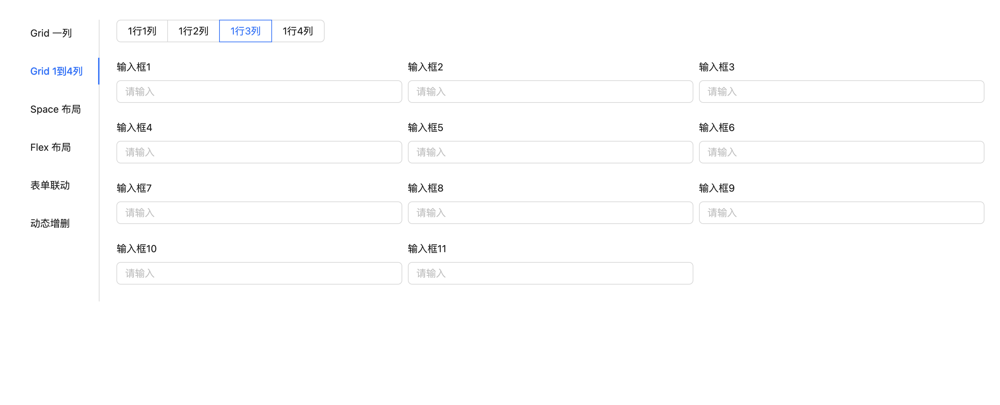
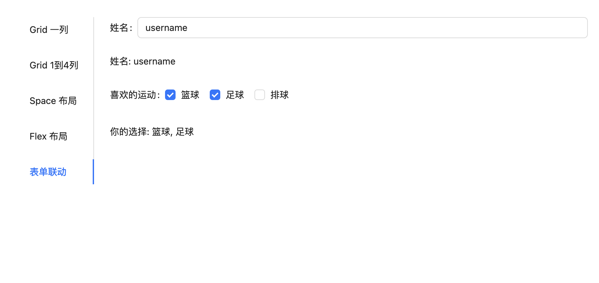

# antd-form-render

使用 js 配置，开发 ant-design 表单， [在线示例](https://leonwgc.github.io/antd-form-render/)

## 安装

用 [npm](https://npmjs.org/) / [yarn](https://yarnpkg.com) 安装:

    $ npm install --save antd-form-render
    $ yarn add antd-form-render

## 特点

1. 基于 js 配置开发 ant design 表单
2. 支持 Grid, Flex, Space 三种布局
3. 与 react 数据驱动视图理念保持一致`UI=F(state)`
4. 基于 react-hooks
5. 使用 typescript 编写，开发智能提示

## 示例

#### Grid 一行一列布局


```tsx
import React from 'react';
import { Form, Button, Input } from 'antd';
import { GridRender } from 'antd-form-render';

const GridOneColumn = () => {
  const [form] = Form.useForm();

  const layout: Item[] = [
    {
      label: '手机号',
      name: 'tel',
      rules: [{ required: true, message: '请输入' }],
      element: <Input placeholder="请输入" maxLength={11} />,
    },
    {
      label: '密码',
      name: 'pwd',
      element: <Input.Password placeholder="请输入"></Input.Password>,
    },
    {
      element: (
        <Flex justify="flex-end">
          <Button type="primary" htmlType="submit">
            保存
          </Button>
        </Flex>
      ),
    },
  ];

  return (
    <Form form={form} layout="vertical" style={{ width: 400 }}>
      <GridRender layout={layout} />
    </Form>
  );
};

export default GridOneColumn;
```

#### Grid 一行 1 ~ 4 列



```tsx
import React, { useState } from 'react';
import { Input, Radio, Form } from 'antd';
import { GridRender } from 'antd-form-render';

const GridNColumns = () => {
  const layout: Item[] = [];
  const [cols, setCols] = useState(4);

  for (let i = 0; i < 11; i++) {
    layout.push({
      label: `输入框${i + 1}`,
      name: `name${i}`,
      element: <Input placeholder="请输入" />,
    });
  }

  return (
    <Form layout="vertical">
      <div style={{ marginBottom: 24 }}>
        <Radio.Group
          onChange={(e) => setCols(Number(e.target.value))}
          optionType="button"
          value={cols}
        >
          <Radio value={1}>1行1列</Radio>
          <Radio value={2}>1行2列</Radio>
          <Radio value={3}>1行3列</Radio>
          <Radio value={4}>1行4列</Radio>
        </Radio.Group>
      </div>

      <GridRender layout={layout} columnCount={cols} gutter={[8, 8]} />
    </Form>
  );
};

export default GridNColumns;
```

#### Space 布局


```tsx
import React, { useState } from 'react';
import { Input, Radio, Form, Button } from 'antd';
import { SpaceRender } from 'antd-form-render';

const SpaceLayout = () => {
  const [form] = Form.useForm();
  const layout: Item[] = [];
  const [space, setSpace] = useState(8);

  for (let i = 0; i < 3; i++) {
    layout.push({
      name: `name${i}`,
      label: `输入框${i + 1}`,
      element: <Input placeholder="请输入" />,
    });
  }

  layout.push({
    element: (
      <Button
        type="primary"
        onClick={() => {
          console.log(form.getFieldsValue());
        }}
      >
        submit
      </Button>
    ),
  });

  return (
    <Form form={form} layout="horizontal">
      <div style={{ marginBottom: 24 }}>
        <Radio.Group
          onChange={(e) => setSpace(Number(e.target.value))}
          optionType="button"
          value={space}
        >
          <Radio value={8}>8px</Radio>
          <Radio value={16}>16px</Radio>
          <Radio value={24}>24px</Radio>
          <Radio value={32}>32px</Radio>
        </Radio.Group>
      </div>

      <SpaceRender layout={layout} size={space} />
    </Form>
  );
};

export default SpaceLayout;
```

#### Flex 布局


```tsx
import React, { useState } from 'react';
import { Input, Radio, Form, Button } from 'antd';
import { FlexRender, Item } from 'antd-form-render';

const FlexLayout = () => {
  const [form] = Form.useForm();
  const layout: Item[] = [];
  const [gap, setGap] = useState(8);

  for (let i = 0; i < 3; i++) {
    layout.push({
      name: `name${i}`,
      label: `输入框${i + 1}`,
      element: <Input placeholder="请输入" />,
    });
  }

  layout.push({
    element: (
      <Button
        type="primary"
        onClick={() => {
          console.log(form.getFieldsValue());
        }}
      >
        submit
      </Button>
    ),
  });

  return (
    <Form form={form} layout="horizontal">
      <div style={{ marginBottom: 24 }}>
        <Radio.Group
          onChange={(e) => setGap(Number(e.target.value))}
          optionType="button"
          value={gap}
        >
          <Radio value={8}>8px</Radio>
          <Radio value={16}>16px</Radio>
          <Radio value={24}>24px</Radio>
          <Radio value={32}>32px</Radio>
        </Radio.Group>
      </div>

      <FlexRender layout={layout} gap={gap} justify="flex-end" />
    </Form>
  );
};

export default FlexLayout;
```

#### 表单联动

1. 定义 form onValuesChange 同步状态到外部 state, 触发重新渲染实现表单联动（全量渲染）
2. 利用 Form.Item dependencies / shouldUpdate 和自定义 render 实现表单联动 (非全量渲染)



```tsx
import React from 'react';
import { Form, Radio, Divider } from 'antd';
import { GridRender, Item } from 'antd-form-render';

const DynamicRender = () => {
  const [form] = Form.useForm();

  const layout: Item[] = [
    {
      label: '姓名',
      name: 'name',
      element: <Input placeholder="请输入" />,
    },
    {
      itemProps: {
        noStyle: true,
      },
      element: () =>
        form.getFieldValue('name') ? (
          <div style={{ marginBottom: 24 }}>
            姓名: {form.getFieldValue('name')}
          </div>
        ) : null,
    },
    {
      label: '喜欢的运动',
      name: 'sports',
      element: <Checkbox.Group options={['篮球', '足球', '排球']} />,
    },
    {
      element: () =>
        form.getFieldValue('sports')?.length ? (
          <div> 你的选择: {form.getFieldValue('sports')?.join(', ')}</div>
        ) : (
          '未选择任何运动'
        ),
    },
  ];

  return (
    <div>
      <Form form={form}>
        <GridRender layout={layout}></GridRender>
      </Form>
    </div>
  );
};

export default DynamicRender;
```

### 组件类型定义

```ts
import { Rule } from 'rc-field-form/lib/interface';
import type { SpaceProps, FlexProps, RowProps } from 'antd';
/**
 * Render配置项
 *
 * @export
 * @interface Item
 */
export type Item = {
    /**
     * React Node, 优先级高于type定义的组件类型
     * 定义了element，会优先type渲染 , 优先级 element > render function > type + elProps 定义的组件
     */
    element?: React.ReactNode | null | (() => React.ReactNode | null);
    /**
     * React组件类型，例如：Input、DatePicker, "input"
     */
    type?: React.ComponentType | string;
    /**
     * Form.Item name 字段
     */
    name?: string | Array<string | number>;
    /**
     * Form.Item label
     */
    label?: React.ReactNode;
    /**
     * 自定义渲染
     */
    render?: () => React.ReactNode;
    /**
     * 动态返回Item，优先级高于render
     */
    getJSON?: () => Item | null;
    /**
     * 组件props,会透传给type定义的组件
     */
    elProps?: Record<string, unknown>;
    /**
     * Form.Item的props,会透传给Form.Item
     */
    itemProps?: FormItemProps;
    /**
     * Form.Itemrules,也可在itemProps里定义
     */
    rules?: Rule[];
};

export type GridRenderProps = RowProps & {
  /**
   * 布局配置
   */
  layout: Item[];
  /**
   * GridRender 一行的列数, 可以是: 1 | 2 | 3 | 4, 默认1,
   */
  columnCount?: number;
};
export type SpaceRenderProps = SpaceProps & {
  /**
   * 1维数组，存储组件配置信息/自定义渲染组件
   */
  layout: Item[];
};
export type FlexRenderProps = Partial<FlexProps> & {
  layout: Item[];
};
export type layoutType = 'grid' | 'space' | 'flex';

/**
 * Grid布局
 *
 * @param {GridRenderProps} props - The properties for the GridRender component.
 * @param {Item[]} props.layout - The layout data, an array of items to be rendered in the grid.
 * @param {number} [props.columnCount=1] - The number of columns in the grid.
 * @param {object} ..rest - Additional properties to be passed to the inner Row component.
 * @returns {React.ReactElement} The rendered grid layout.
 */
declare const GridRender: React.FC<GridRenderProps>;

/**
 * Flex布局
 *
 * @param {FlexRenderProps} props - The properties for the FlexRender component.
 * @param {Item[]} props.layout - The layout data, an array of items to be rendered in the flex layout.
 * @param {FlexProps} [props.flexProps] - Additional properties to be passed to the inner Flex component.
 * @returns {React.ReactElement} The rendered flex layout.
 */
declare const FlexRender: React.FC<FlexRenderProps>;

/**
 * Space 布局
 *
 * @param {SpaceRenderProps} props - The properties for the SpaceRender component.
 * @param {Item[]} props.layout - The layout data, an array of items to be rendered in the space.
 * @returns {React.ReactElement} The rendered space layout.
 */
declare const SpaceRender: React.FC<SpaceRenderProps>;
```
